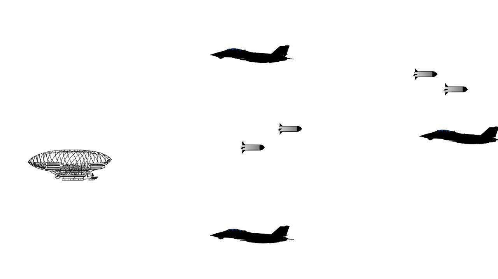

# Battle Zeppelin 
This is a very simple 2D game I made using C# and Unity. 

# Controllers (For those who want to play it) 

| Key | Action |
|:---:|:------:|
| Up arrow | Zeppelin moves up | 
| Down arrow | Zeppelin moves down | 
| Space      | shooting            | 
| ESC        | Pause               |
| R          | Reloads game (only when Zeppelin is hit by planes) |  
| Q          | Just terminates the application                    |

# Screenshot 
